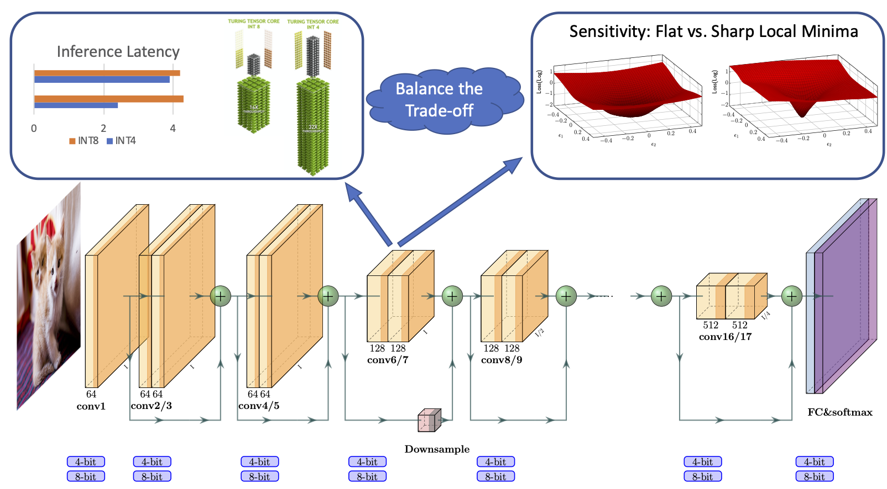

<p align="center">
  
  <br />
  <br />
  </p>

# HAWQ: Hessian AWare Quantization

HAWQ is an advanced quantization library written for PyTorch. HAWQ enables low-precision and mixed-precision uniform quantization, with direct hardware implementation through TVM.

For more details please see:

- [HAWQ-V3 lightning talk in TVM Conference](https://www.youtube.com/watch?v=VRiujqKU254)
- [HAWQ-V2 presentation in NeurIPS'20](https://neurips.cc/virtual/2020/public/poster_d77c703536718b95308130ff2e5cf9ee.html)

## Installation

* [PyTorch](http://pytorch.org/) version >= 1.4.0
* Python version >= 3.6
* For training new models, you'll also need NVIDIA GPUs and [NCCL](https://github.com/NVIDIA/nccl)
* **To install HAWQ** and develop locally:
```bash
git clone https://github.com/Zhen-Dong/HAWQ.git
cd HAWQ
pip install -r requirements.txt
```

## Getting Started
### Quantization-Aware Training
An example to run uniform 8-bit quantization for resnet50 on ImageNet. 
```
export CUDA_VISIBLE_DEVICES=0
python quant_train.py -a resnet50 --epochs 1 --lr 0.0001 --batch-size 128 --data /path/to/imagenet/ --pretrained --save-path /path/to/checkpoints/ --act-range-momentum=0.99 --wd 1e-4 --data-percentage 0.0001 --fix-BN --checkpoint-iter -1 --quant-scheme uniform8
```
The commands for other quantization schemes and for other networks are shown in the [model zoo](model_zoo.md).

### Inference Acceleration
* [Instructions on Hardware Implementation through TVM](tvm_benchmark/README.md)

## Experimental Results
**Table I and Table II in [HAWQ-V3: Dyadic Neural Network Quantization](https://arxiv.org/abs/2011.10680)**

### ResNet18 on ImageNet 
Model | Quantization | Model Size(MB) | BOPS(G) | Accuracy(%) | Inference Speed (batch=8, ms) | Download
---|---|---|---|---|---|---
`ResNet18` | Floating Points | 44.6 | 1858 | 71.47 | 9.7 (1.0x) | [resnet18_baseline](https://drive.google.com/file/d/1C7is-QOiSlLXKoPuKzKNxb0w-ixqoOQE/view?usp=sharing)
`ResNet18` | W8A8            | 11.1 | 116  | 71.56 | 3.3 (3.0x) | [resnet18_uniform8](https://drive.google.com/file/d/1CLAd3LhiRVYwiBZRuUJgrzrrPFfLvfWG/view?usp=sharing)
`ResNet18` | Mixed Precision | 6.7  | 72   | 70.22 | 2.7 (3.6x) | [resnet18_bops0.5](https://drive.google.com/file/d/1DbDXYdulvvb9YOG1fRSrCVPvry_Reu8z/view?usp=sharing)
`ResNet18` | W4A4            | 5.8  | 34   | 68.45 | 2.2 (4.4x) | [resnet18_uniform4](https://drive.google.com/file/d/1D4DPcW2s9QmSnKzUgcjH-2eYO8zpDRIL/view?usp=sharing)

### ResNet50 on ImageNet
Model | Quantization | Model Size(MB) | BOPS(G) | Accuracy(%) | Inference Speed (batch=8, ms) | Download
---|---|---|---|---|---|---
`ResNet50` | Floating Points | 97.8 | 3951 | 77.72 | 26.2 (1.0x) | [resnet50_baseline](https://drive.google.com/file/d/1CE4b05gwMzDqcdpwHLFC2BM0841qKJp8/view?usp=sharing)
`ResNet50` | W8A8            | 24.5 | 247  | 77.58 | 8.5 (3.1x)  | [resnet50_uniform8](https://drive.google.com/file/d/1Ldo51ZPx6_2Eq60JgbL6hdPdQf5WbRf9/view?usp=sharing)
`ResNet50` | Mixed Precision | 18.7 | 154  | 75.39 | 6.9 (3.8x)  | [resnet50_bops0.5](https://drive.google.com/file/d/1DNUkyavD10saZw9_7TzJhEy0NFPhSVZr/view?usp=sharing)
`ResNet50` | W4A4            | 13.1 | 67   | 74.24 | 5.8 (4.5x)  | [resnet50_uniform4](https://drive.google.com/file/d/1DDis-8C-EupCRj-ExH58ldSv-tG2RXyf/view?usp=sharing)

More results for different quantization schemes and different models (also the corresponding commands and important notes) are available in the [model zoo](model_zoo.md).  \
To download the quantized models through wget, please refer to a simple command in [model zoo](model_zoo.md). \
Checkpoints in [model zoo](model_zoo.md) are saved in floating point precision. To shrink the memory size, [BitPack](https://github.com/Zhen-Dong/BitPack) can be applied on [weight_integer](https://github.com/Zhen-Dong/HAWQ/blob/main/quant_train.py#L667) tensors, or directly on quantized_checkpoint.pth.tar file.

## Related Works
  - [HAWQ-V3: Dyadic Neural Network Quantization (ICML 2021)](https://arxiv.org/abs/2011.10680)
  - [HAWQ-V2: Hessian Aware trace-Weighted Quantization of Neural Networks (NeurIPS 2020)](https://proceedings.neurips.cc//paper/2020/file/d77c703536718b95308130ff2e5cf9ee-Paper.pdf)
  - [HAWQ: Hessian AWare Quantization of Neural Networks with Mixed-Precision (ICCV 2019)](https://openaccess.thecvf.com/content_ICCV_2019/html/Dong_HAWQ_Hessian_AWare_Quantization_of_Neural_Networks_With_Mixed-Precision_ICCV_2019_paper.html)


## License
HAWQ is released under the [MIT license](LICENSE).
